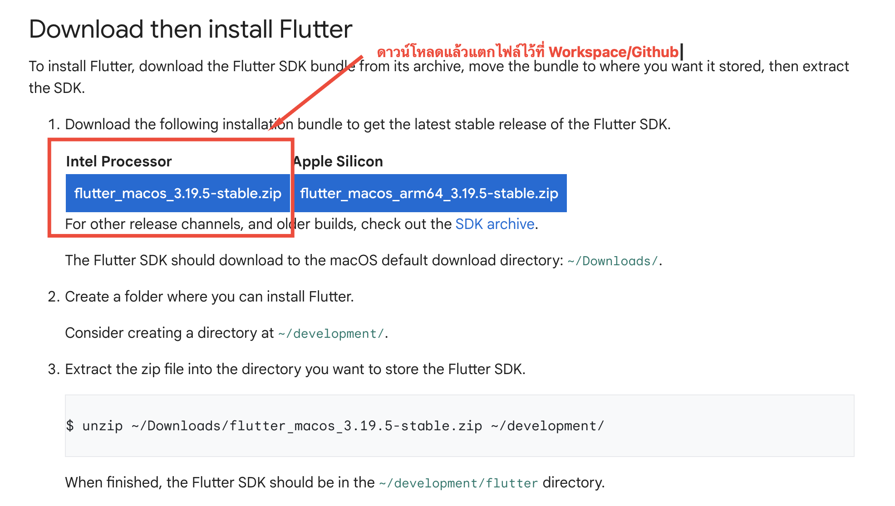
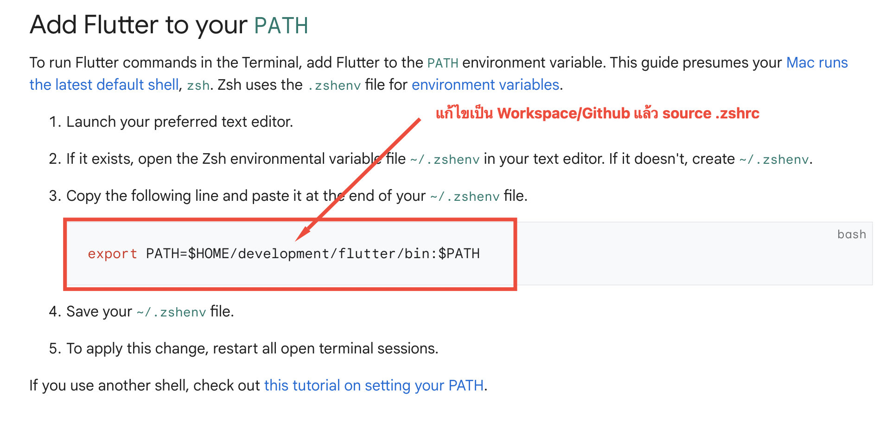

# Flutter Manual

## Download
> https://docs.flutter.dev/get-started/install

```
Make iOS apps

link https://docs.flutter.dev/get-started/install/macos/mobile-ios?tab=download
```





## Configure your iOS simulator
```
xcodebuild -downloadPlatform iOS
```

```
open -a Simulator
```

## Install cocoapods
```
brew cleanup -d -v 
brew install cocoapods 
brew link --overwrite cocoapods
```

## Check
```
flutter doctor
```